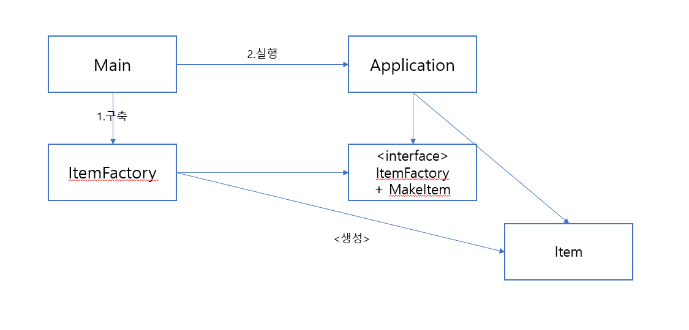

# 11장 시스템

깨끗한 코드를 구현하면 낮은 추상화 수준에서 쉽게 관심사를 분리 가능
높은 추상화 수준 -> 시스템 수준에서 깨끗함을 유지하는 방법

### 시스템 제작과 시스템 사용을 분리하라

- construction과 use는 아주 다름
- 관심사 분리 -> 중요한 설계 기법

```
public Service getService() {
    if(service == null)
        service = new MyServiceImpl(...);
    return service;
}
```
- 위 방식은 초기화 지연 / 계산 지연이라는 기법
    - 실제 필요할 때까지 객체를 생성하지 않으므로 불필요한 부하가 걸리지 않음
    - 어떠한 경우에도 null 포인터를 반환하지 않음
- 하지만 생성자 인수에 명시적으로 의존하기 떄문에 해결하지 않으면 컴파일이 안된다.
- 또한 테스트 과정에서 mock 객체를 service에 할당해야 한다
    - 해당 코드는 service에 대한 경로도 갈래가 있음
    - 런타임 로직에 생성자 로직이 섞여 있음
    - 이는 책임이 둘이고 메서드가 2가지 이상의 작업 수행 요구
- 따라서 의존성을 해결하는 방법 -> 설정 논리 / 일반 논리를 분리해야 모듈성이 높아짐


### Main 분리

- 시스템 생성과 시스템 사용을 분리하는 방법
- 생성과 관련된 코드는 main이나 main이 호출하는 모듈로 이동


- 메인 함수는 위 그림에서 객체가 생성되는 과정을 모른다

### 팩토리

- 객체가 생성되는 시점을 어플리케이션이 결정할 필요성이 생긴다
- 이때 Abstract factory 패턴을 이용
- Item을 생성하는 시점은 Application이 정하지만 생성하는 코드는 모른다



- application은 item 이 생성되는 구체적인 방법을 모른다
- 그럼에도 생성 시점은 통제가 가능하고 생성자 인수도 넘기기 가능

### 의존성 주입

- IoC 기법을 의존성 관리에 적용한 매커니즘
    - 한 객체가 많은 보조 책임을 새로운 객체에게 넘김 (Spring 구조)
- 객체는 인스턴스 생성에 대한 책임을 지지 않음
- 객체를 호출할 경우 직접 제어하지 않음
- Setter이나 생성자 인수를 제공하고, 필요한 객체의 인스턴스를 메서드를 활용하여 설정

- 따라서 대다수의 DI 컨테이너는 필요할때까지 객체를 미생성

### 확장

- TDD, Refactoring으로 얻어지는 코드는 시스템을 쉽게 확장 가능하게 만든다
- 시스템 상 논리적으로 분리를 해야 확장이 쉽기 떄문에 한 객체에서 다른 객체로 자료를 복사하는 반복적인 규격 코드가 필요

##### 횡단(cross-cutting) 관심사

- 트랜잭션, 보안, 일부 영속적인 동작은 배치 기술자에서 정의
- 영속성 같은 관심사는 모든 객체에서 동일하게 이용해야함
- AOP라는 모듈 구성을 이용해서 비즈니스 코드에 영향을 미치지 않 코드를 성해야한다.

### 자바 프록시

- 프록시는 단순한 상황에 적합
- 개별 객체나 클래스에서 메서드 호출을 감싸는 경우에 사용 가능
- 코드의 양과 크기는 프록시의 두가지 단점
    - 따라서 클린코드과는 거리가 멀다

### 순수 자바 AOP 프레임워크

- 대부분의 프록시 코드는 AOP로 대체 가능
- 스프링은 비즈니스 로직을 POJO로 구현
    - 도메인에 초점을 맞춤
    - 의존하지 않기에 보수하고 개선하기 편함
- DI 컨테이너에게 최상위 계층을 요청한다해도 스프링관련 자바 코드가 거의 없기 떄문에 독립적
    - EJB의 강한 경합 문제를 해결 가능
- Annotiation 영속성 전부를 분리한다면, 순수한 POJO 코드만 남기에 문제 발생 가능성이 현저히 적다

### AspectJ 관점

- AspectJ 언어는 관심사를 Aspect로 구분하는 가장 강력한 도구

### 테스트 주도 시스템 아키텍쳐 구분

- 관심사를 분리하고 도메인 논리를 POJO로 작성하여 아키텍쳐 관심사를 분리할 경우 TDD 아키텍쳐를 제대로 구축 가능
- 좋은 API는 걸리적 거리지 않아야 한다.

### 의사 결정을 최적화 하자

- 시스템 상에서 가능한 마지막 까지 결정을 미뤄서 적합한 객체에게 책임을 맡기자

### 명백한 가치가 있을 떄 표준을 현명하게 사용하자

- 표준을 사용하는 것은 아이디어 / 컴포넌트의 재사용이 쉽지만, 그 목적을 절대 잊고 사용해서는 안된다

### 시스템은 도메인 특화 언어가 필요하다

- DSL같은 도메인 특화 언어는 전문가가 작성한 구조적인 산문처럼 읽힘
- 팀과 이해관계자 사이에 간극을 줄여준다
- 개발자는 적절한 추상화 수준을 코드에서 구현해야 한다

### 결론

- 시스템은 꺠끗해야한다
    - 도메인 논리를 흐리지 말자
- 의도를 명확하게 해야한다.
    - POJO를 통해 구현 관심사를 분리해야 한다

    