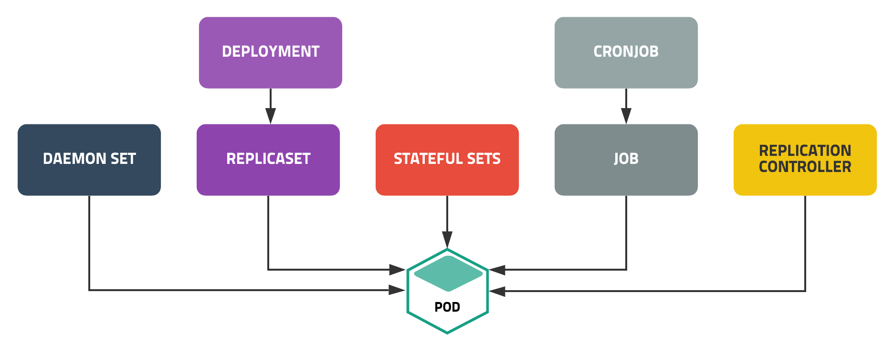

# Kubernates

## 쿠버네티스는 왜 쓰게 되었는가?


#### 전통 배포

- 물리 서버 실행 -> 여러 어플리케이션 실행 -> 성능 저하

#### 가상화 배포

VM 간에 보안성 재고 가능 -> 쉽게 어플리케이션을 추가하거나 업데이트 가능

#### 컨테이너 개발 시대

격리 속성 완화 -> 어플리케이션 간 OS 공유 하는 상태

- 속성
    - 기민한 어플리케이션 생성 & 배포
    - CI, CD의 쉬운 롤백
    - Dev & Oper 분리
    - Public Cloud - OS 배포판과의 호환성

- 기능
    - 서비스 디스커버리 & 로드 밸런싱
    - 스토리지 오케스트레이션
    - Auto Rollback
    - Bin Packing
    - Self-healing

- 응용
    - Apache Kafka 같은 실시간 데이터 스트리밍과 신속한 확장을 요하는 Cloud Native Aplication을 호스팅

- 장점
    - IT 보안 강화 가능
    - 운영 작업 가능화
    - 하드웨어 최대한 활용 하여 리소스를 늘릴 수 있음
    - 배포 및 업데이트를 제어 및 자동화
    - 즉시 확장 가능

- 사용 가능 타 오브젝트
    - Registry : Docker Registry, Atomic Registry
    - Networking
    - Telemetry : ELK 같은 프로젝트
    - Security 
  
#### 추가 장점 소개

- 기존 쿠버네티스의 생태계


- 다양한 배포 방식



- 다양한 클라우드 지원

- 클러스터의 논리적 구분 가능


- 권한 제어


출처 : [쿠버네이트 소개](https://subicura.com/2019/05/19/kubernetes-basic-1.html)


## Component


#### 구성


##### 요약

```
마스터: 쿠버네티스 노드를 제어하는 머신입니다. 여기에서 모든 태스크 할당이 시작됩니다.

노드: 할당된 태스크를 요청대로 수행하는 시스템입니다. 쿠버네티스 마스터가 이러한 노드를 제어합니다.

포드: 단일 노드에 배포된 하나 이상의 컨테이너 그룹입니다. 포드에 있는 모든 컨테이너는 IP 주소, IPC, 호스트 이름, 기타 리소스를 공유하며 포드는 기본 컨테이너에서 네트워크와 스토리지를 추상화합니다 이렇게 하면 클러스터에서 컨테이너를 더 쉽게 이동할 수 있습니다.

복제 컨트롤러:  이 컨트롤러는 클러스터에서 실행되어야 하는 동일한 포드 사본의 개수를 제어합니다.

서비스: 포드에서 작업 정의를 분리합니다 쿠버네티스 서비스 프록시는 클러스터에서 다른 위치로 이동한 경우든 교체된 경우든 서비스 요청을 적절한 포드로 자동 수신합니다.

Kubelet: 이 서비스는 노드에서 실행되며 컨테이너 매니페스트를 읽고, 정의된 컨테이너가 시작되어 실행 중인지 확인합니다

kubectl: 쿠버네티스의 명령줄 설정 툴입니다.
```


- Kubernates
    - Nodes
        - Worker Node
            - Pod

    - Control Plane : Pod/클러스터에 대한 전반적인 결정을 호스트
        - kube-apiserver : 수평으로 확장
        - etcd : 클러스터 키값을 담는 key-value 저장소
        - kube-scheduler : Pod 감지 / 실행 노드 선택
        - kube-controller-manager : 컨트롤러 프로세스 실행
            - Node Controller : 노드 다운에 대한 책임
            - Replication Controller : 알맞은 수의 파드 유지
            - End Point Controller : 엔드 포인트 오브젝트 채움
            - Service Acoount & Token Controller : 계정과 API 접근 토큰 생성
        - cloud-controller-manager : 클라우드와의 상호 작용하는 컴포넌트
            - Node Controlller
            - Route Controller
            - Service Controller

    - Node Component
        - kubelet : Pod에서 Container 동작 관리
        - kube-proxy : 네트워크 프록시
        - Container Runtime : 컨테이너 실행 담당 소프트웨어    

