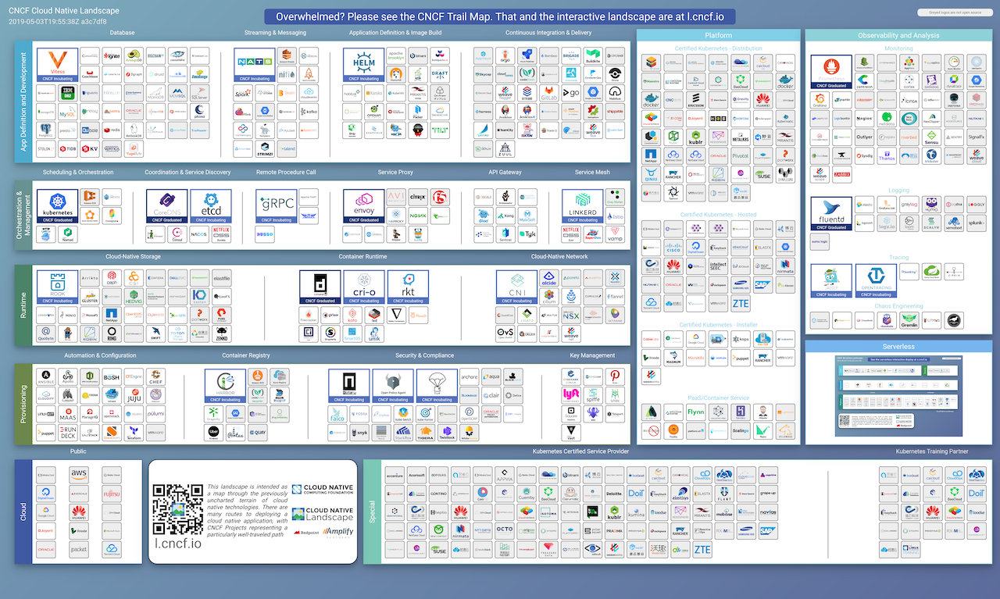
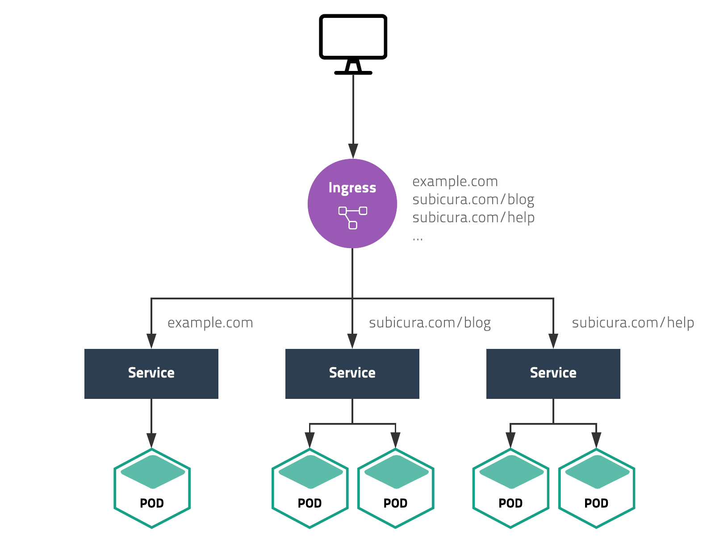
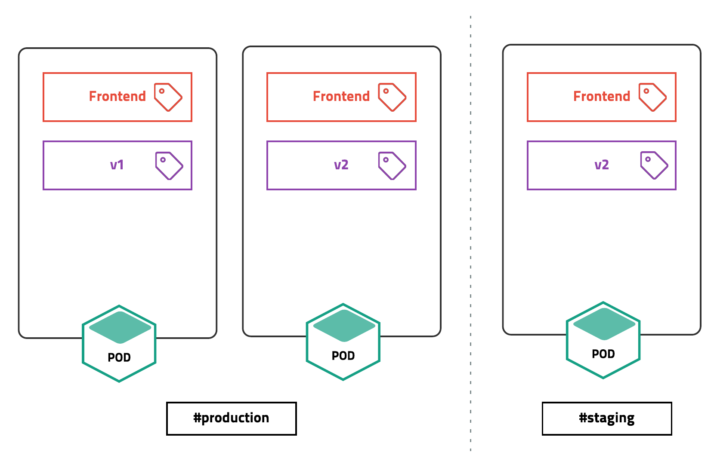
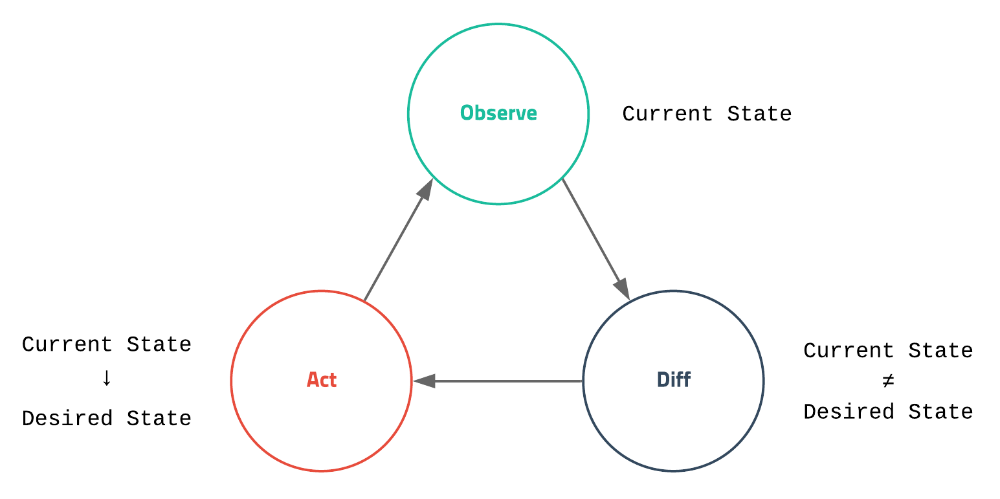
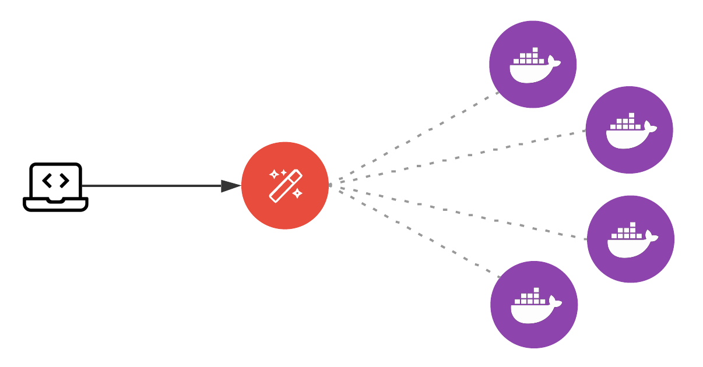
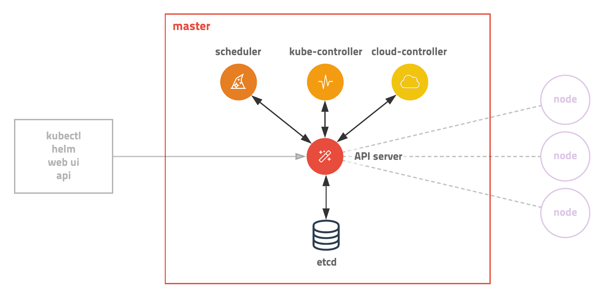
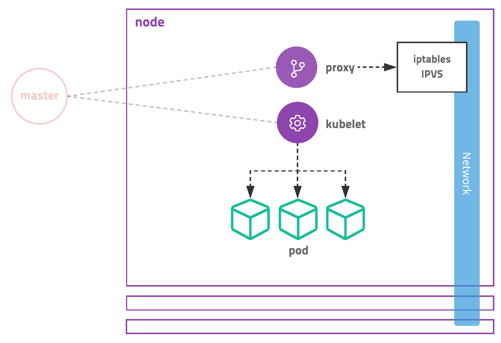

# Kubernates

## 쿠버네티스는 왜 쓰게 되었는가?


#### 전통 배포

- 물리 서버 실행 -> 여러 어플리케이션 실행 -> 성능 저하

#### 가상화 배포

VM 간에 보안성 재고 가능 -> 쉽게 어플리케이션을 추가하거나 업데이트 가능

#### 컨테이너 개발 시대

격리 속성 완화 -> 어플리케이션 간 OS 공유 하는 상태
```
- 속성
    - 기민한 어플리케이션 생성 & 배포
    - CI, CD의 쉬운 롤백
    - Dev & Oper 분리
    - Public Cloud - OS 배포판과의 호환성

- 기능
    - 서비스 디스커버리 & 로드 밸런싱
    - 스토리지 오케스트레이션
    - Auto Rollback
    - Bin Packing
    - Self-healing

- 응용
    - Apache Kafka 같은 실시간 데이터 스트리밍과 신속한 확장을 요하는 Cloud Native Aplication을 호스팅

- 장점
    - IT 보안 강화 가능
    - 운영 작업 가능화
    - 하드웨어 최대한 활용 하여 리소스를 늘릴 수 있음
    - 배포 및 업데이트를 제어 및 자동화
    - 즉시 확장 가능

- 사용 가능 타 오브젝트
    - Registry : Docker Registry, Atomic Registry
    - Networking
    - Telemetry : ELK 같은 프로젝트
    - Security 
  ```
#### 추가 장점 소개
    기존 쿠버네티스의 생태계에서 지원하는 것들
        - Service Mesh
        - CI
        - Converter Serverless
        - Machine Learning



#### 다양한 배포 방식
    Deployment
        무중단배포
    StatefulSets
        호스트 이름이나 볼륨을 일정하게 사용
    Daemon Set
        로그나 모니터링을 위한 설치
    CRON
        배치성 작업


#### Ingress 설정
    - 프록시 서버에서 메인 서버에 IP 할당 및 Path 조건을 자동 할당
    - 하나의 클러스터에서 여러개의 Ingress 설정을 관리 가능




#### 다양한 클라우드 지원

#### 클러스터의 논리적 구분 가능


- 하나의 클러스터 내부에서 라벨링을 통해 리소스를 분할해서 사용 가능

- 권한 제어


    각 리소스 별 CRUD 권한 지정을 통해 적용 가능
    클러스터 전체 또는 클러스터 내부의 경우 Namespace를 통한 설정 제어 가능

#### CRD
    쿠버네티스가 지원하지 않는 기본기능을 적용 가능
        ex) cert-manager을 통한 인증서 관리 - 쿠버네티스 명령어로 인증서 처리

### Auto Scaling
    CPU, memory 사용량에 따른 확장을 현재 사용자에 비례한 값으로 조절 가능
        HPA(Horizontal Pod Autoscaler) : 컨테이너 개수 조절 기능
        VPA(Vertical Pod Autoscaler) : 컨테이너 리소스 할당량 조절
        CA (Cluster Autoscaler) : 서버 개수 조정

### Federation, Multi cluster
    여러 서버를 묶어서 관리 가능


## 쿠버네티스 기본 개념

#### Desired State
    Desired State - 원하는 상태
        관리자가 원하는 상태
        웹 서버의 개수, 어떤 포트로 서비스의 조건
        현재 상태를 Desired State로 바꾸기 위해 명령



### Kubernetes Object

#### Pod
    쿠버네티스에서 배포할 수 있는 가장 작은 단위
    하나 이상의 컨테이너, 스토리지, 네트워크 속성을 가짐
    Pod의 컨테이너는 서로 간 공유


#### ReplicaSet
    Pod를 여러 개 복제하여 관리하는 오브젝트
    복제할 개수, 라벨 선택자, Pod 설정 값이 존재
    Deployment 등을 통해 제어

#### Service
    Pod를 외부와 연결
    내부적 로드밸런싱
    서비스 디스커버리

#### Volume
    저장소 관련 오브젝트
    많은 저장소 타입 제공

#### Object Spec - YAML
    YAML 파일로 1.CRUD 관리 2.접근 권한 생성
    REST API로 쉽게 노출

#### 쿠버네티스 배포방식
    Desired State를 만들기 위해 Object에 Label을 붙여 yaml 파일을 통해 정의하고 API를 통해 전달
    
    ex) “컨테이너를 Pod으로 감싸고 type=app, app=web이라는 라벨을 달아줘. type=app, app=web이라는 라벨이 달린 Pod이 2개 있는지 체크하고 없으면 Deployment Spec에 정의된 템플릿을 참고해서 Pod을 생성해줘. 그리고 해당 라벨을 가진 Pod을 바라보는 가상의 서비스 IP를 만들고 외부의 80 포트를 방금 만든 서비스 IP랑 연결해줘.”

## 쿠버네티스 아키텍쳐
    기본 구조는 컨테이너를 관리하는 Agent가 있고 이를 API를 이용하여 컨테이너를 관리 하는 모습


### 마스터 - 노드
    마스터에 명령을 내리고 노드가 수행하는 구조


#### Master
    마스터 서버는 다양한 모듈을 확장성을 고려해야 함
    마스터 서버의 가용성을 위해 3대 이상 배치, 보안 설정 필요
    ex) EKS는 AWS 자체에서 Master 관리
    ex) 소규모 환경 또는 개발 환경에서는 Master와 Node를 한 서버에 넣기도 함

#### Node
    마스터와의 통신을 Pod 생성 / 네트워크, 볼륨 설정
    서버에 라벨링을 통한 용도 확정

#### Kubectl
    json 혹은 protobuf 형식을 통해서 http 통신을 지원
    bash 커맨드에서 kubectl 명령행을 통해 cube control 사용

### Master 구성 요소



#### API 서버 kube-apiserver
    API 서버는 모든 요청을 처리
        kubectl 요청, 내부 모듈 요청, 권한에 따른 요청 거부승인
        key-value 조회만 진행

#### 분산 데이터 저장소 etcd
    RAFT를 이용한 key-value 저장소
    watch 기능을 통해 상태 변경에 따른 로직 실행 가능
    1.클러스터 설정 2.config가 저장되기 때문에 클러스터를 언제든지 해당 저장소에 꺼내서 복구 가능
    가벼운 저장소의 경우 sqlite를 사용하기도 함

#### 스케쥴러, 컨트롤러
    해당 컴포넌트에서 실제 상태를 변경

##### 스케쥴러 (scheduler)
    Pod를 적절한 노드 서버에 할당

##### 큐브 컨트롤러 (kube-controller)
    모든 오브젝트 상태를 관리
    Deployment -> ReplicaSet -> Pod 생성

##### 클라우드 컨트롤러 (cloud-controller-manager)
    AWS, GCP 등의 노드를 로드 밸러서를 연결하거나 볼륨을 붙일 수 있음

### Node 구성 요소



#### 큐블릿 (kubelet)
    Pod의 생명 주기 관리
    주기적으로 마스터에 상태를 전달

#### 프록시 (kube-proxy)
    Pod에 연결되는 네트워크 관리
    TCP, UDP, SCT 스트림 포워딩, 라운드 로빈을 통한 로드밸런싱
        ex) iptables, IPVS을 사용

#### 추상화
    도커처럼 사용 가능

## Pod 생성 흐름


- 각 모듈간 통신은 API 서버로만 통신


#### Kubectl
    ReplicaSet 명세를 yml파일로 정의하고 kubectl 도구를 이용하여 API Server에 명령을 전달
    
    API Server는 새로운 ReplicaSet Object를 etcd에 저장


#### Kube Controller
    Kube Controller에 포함된 ReplicaSet Controller가 ReplicaSet을 감시하다가 ReplicaSet에 정의된 Label Selector 조건을 만족하는 Pod이 존재하는지 체크
 
    해당하는 Label의 Pod이 없으면 ReplicaSet의 Pod 템플릿을 보고 새로운 Pod(no assign)을 생성. 생성은 역시 API Server에 전달하고 API Server는 etcd에 저장

#### Scheduler
    Scheduler는 할당되지 않은(no assign) Pod이 있는지 체크
    
    할당되지 않은 Pod이 있으면 조건에 맞는 Node를 찾아 해당 Pod을 할당

#### Kubelet
    Kubelet은 자신의 Node에 할당되었지만 아직 생성되지 않은 Pod이 있는지 체크
 
    생성되지 않은 Pod이 있으면 명세를 보고 Pod을 생성

    Pod의 상태를 주기적으로 API Server에 전달


출처 : [쿠버네이트 소개](https://subicura.com/2019/05/19/kubernetes-basic-1.html)

## Component

#### 구성


##### 요약

```
마스터: 쿠버네티스 노드를 제어하는 머신입니다. 여기에서 모든 태스크 할당이 시작됩니다.

노드: 할당된 태스크를 요청대로 수행하는 시스템입니다. 쿠버네티스 마스터가 이러한 노드를 제어합니다.

포드: 단일 노드에 배포된 하나 이상의 컨테이너 그룹입니다. 포드에 있는 모든 컨테이너는 IP 주소, IPC, 호스트 이름, 기타 리소스를 공유하며 포드는 기본 컨테이너에서 네트워크와 스토리지를 추상화합니다 이렇게 하면 클러스터에서 컨테이너를 더 쉽게 이동할 수 있습니다.

복제 컨트롤러:  이 컨트롤러는 클러스터에서 실행되어야 하는 동일한 포드 사본의 개수를 제어합니다.

서비스: 포드에서 작업 정의를 분리합니다 쿠버네티스 서비스 프록시는 클러스터에서 다른 위치로 이동한 경우든 교체된 경우든 서비스 요청을 적절한 포드로 자동 수신합니다.

Kubelet: 이 서비스는 노드에서 실행되며 컨테이너 매니페스트를 읽고, 정의된 컨테이너가 시작되어 실행 중인지 확인합니다

kubectl: 쿠버네티스의 명령줄 설정 툴입니다.
```


- Kubernates
    - Nodes
        - Worker Node
            - Pod

    - Control Plane : Pod/클러스터에 대한 전반적인 결정을 호스트
        - kube-apiserver : 수평으로 확장
        - etcd : 클러스터 키값을 담는 key-value 저장소
        - kube-scheduler : Pod 감지 / 실행 노드 선택
        - kube-controller-manager : 컨트롤러 프로세스 실행
            - Node Controller : 노드 다운에 대한 책임
            - Replication Controller : 알맞은 수의 파드 유지
            - End Point Controller : 엔드 포인트 오브젝트 채움
            - Service Acoount & Token Controller : 계정과 API 접근 토큰 생성
        - cloud-controller-manager : 클라우드와의 상호 작용하는 컴포넌트
            - Node Controlller
            - Route Controller
            - Service Controller

    - Node Component
        - kubelet : Pod에서 Container 동작 관리
        - kube-proxy : 네트워크 프록시
        - Container Runtime : 컨테이너 실행 담당 소프트웨어    

